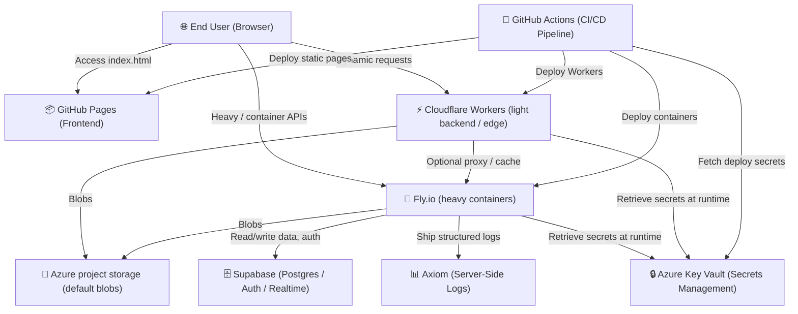
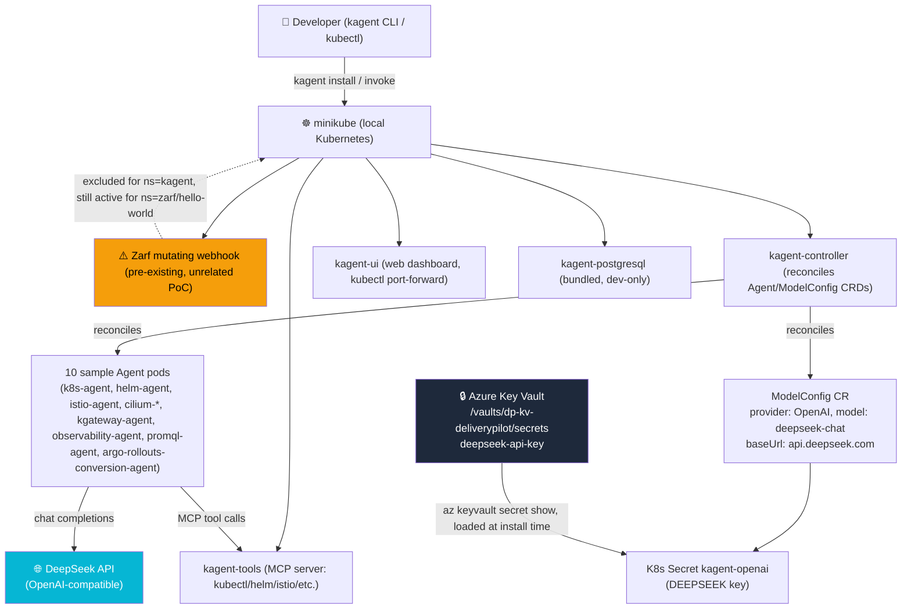

# 🏗️ System Architecture Overview

> **Stage 2 of 7 (Environment):** High-level system design, deployment layout, and component interaction.
> If the system architecture changes, developers and AI agents must update this document to keep it accurate.

---

## 🗺️ High-Level System Architecture

This project is built as a highly responsive, modern static application on **GitHub Pages**. Apps with a backend deploy to **Cloudflare Workers** or **Fly.io** based on requirements (RULE-003 / SPEC-012): lightweight/stateless backends go to Workers; **heavy container** workloads go to Fly.io. Both take credentials from **Azure Key Vault**. Default file/blob storage is **Azure project-based storage** (RULE-004).

---

## 🧩 Core Components

### 1. Frontend Static Layer (`index.html`)
- **Hosting:** Hosted directly at the root of the repository on GitHub Pages.
- **Styling & Assets:** Vanilla CSS styling, Fira Code / Outfit / Inter fonts, and FontAwesome icons loaded via CDN.
- **Routing:** Handled dynamically via `5_Symbols/markdown_renderer.html` using query parameters (e.g. `?file=1_Real_Unknown/kanban.md`).
- **Menu System:**
  - **Project Menu:** Always visible, reads from `navigation_config.json`.
  - **Debug Menu:** Configured dynamically, toggled via a floating action button on the bottom right. Persists using cookie values (`debug=true`).
  - **Console Logger:** `debugLog` utility logs loading operations, API integrations, and routing info for developers if debug mode is active.

### 2. Backend — Cloudflare Workers (`2_Environment/cloudflare_workers.md`)
- Target for **lightweight, stateless** backends and edge logic (auth, routing, caching, rate limiting).
- Credentials from Azure Key Vault (RULE-003).

### 3. Backend — Fly.io (`2_Environment/fly_io.md`)
- Target for **heavy container** backends: Docker, persistent processes, filesystems, WebSockets, GPU, long-running jobs.
- Credentials from Azure Key Vault (RULE-003).

### 4. Database & Data Layer (`2_Environment/supabase.md`)
- **Provider:** Supabase (managed PostgreSQL) for structured data, auth, APIs, realtime, and `pgvector`.
- **Default files/blobs:** Azure project-based storage (RULE-004 / SPEC-012), not Supabase Storage or Fly volumes unless Formula records an exception.

### 4b. Azure project storage
- One Azure Storage account (blob containers) scoped to this project. Account keys live in Key Vault.

### 5. Server-Side Logs (`2_Environment/axiom.md`)
- **Provider:** Axiom.
- **Usage:** Centralized, structured server-side logs from Fly.io and CI. Powers querying (APL), dashboards, and alerting.

### 6. Secrets Management (`2_Environment/setup_azure.md`)
- **Provider:** Microsoft Azure Key Vault.
- **Usage:** Stores all API keys, database credentials, and deployment keys. Secrets are loaded at runtime by backend environments or injected during CI/CD steps.

> 📋 For a single reference covering every tool in the stack, see [`tools.md`](./tools.md).

---

## 🤖 kagent-on-minikube Architecture (Project Objective)

> This is this project's **actual runtime architecture** — separate from the website infra above. It targets the OKRs in [`1_Real_Unknown/okrs.md`](../1_Real_Unknown/okrs.md): set up kagent, run sample agents in Kubernetes, on minikube.

**Key facts (as delivered, 2026-09-10):**
- **Cluster:** reused the existing `minikube` profile (Docker driver) already running on this machine — did not create a second cluster.
- **Install:** `kagent install --profile demo` (kagent CLI + Helm chart `0.10.1`), deployed to the `kagent` namespace.
- **Model backend:** DeepSeek via kagent's `OpenAI` provider type with `openAI.baseUrl` overridden to `https://api.deepseek.com` (see [`deepseek.md`](deepseek.md)). Key loaded from Azure Key Vault into a Helm-managed `Secret` (`kagent-openai`) — never written to a manifest or committed.
- **Blocker found in this cluster:** a **Zarf** mutating admission webhook from earlier, unrelated experimentation (`zarf`/`hello-world` namespaces) intercepts image pulls in every namespace except `kube-system` by default. It broke every kagent pod (`ImagePullBackOff`) until the `kagent` namespace was added to that webhook's exclusion list (`kubectl patch mutatingwebhookconfigurations zarf ...`) — a minimal, reversible edit that leaves Zarf's behavior for `zarf`/`hello-world` untouched.
- **Result:** all 10 demo-profile sample agents (`k8s-agent`, `helm-agent`, `istio-agent`, `cilium-debug-agent`, `cilium-manager-agent`, `cilium-policy-agent`, `kgateway-agent`, `observability-agent`, `promql-agent`, `argo-rollouts-conversion-agent`) are `Ready`/`Accepted`/`Running`. A live `message/send` call was confirmed reaching DeepSeek's API — see [R-010 in `risks.md`](../1_Real_Unknown/risks.md) for the one remaining blocker (DeepSeek account balance).

---

## 🛠️ How to Keep This Document Updated

1. **Keep Diagrams in Sync:** If new components are added (e.g. database layers, external OAuth providers), update the Mermaid graph above.
2. **Review Environment Configs:** Ensure that changes here match setup instructions in `setup_mac.md`, `setup_windows.md`, and `setup_ai.md`.
3. **Verify Rendering:** Ensure that Mermaid rendering works on the compiled web page via `5_Symbols/markdown_renderer.html`.
