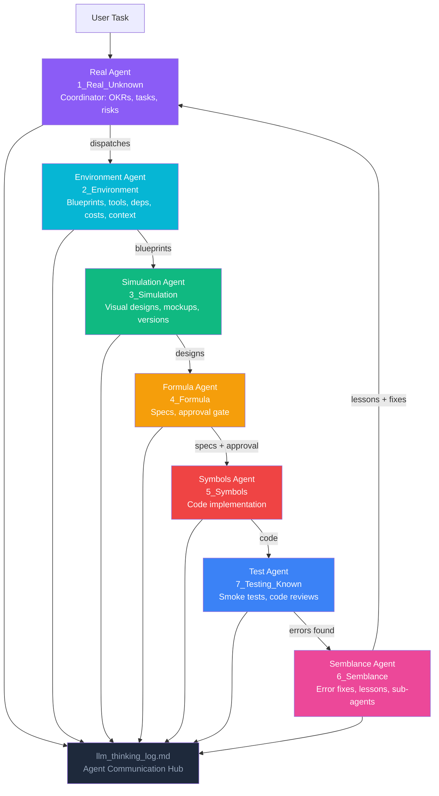

# kAgent

> https://rifaterdemsahin.github.io/kAgent/index.html

Kubernetes agents in the minikube running proof of concept — built on the [delivery-pilot-template](https://github.com/rifaterdemsahin/delivery-pilot-template)'s structured 7-stage framework with 7 dedicated agents that guide the journey from problem definition to validated deployment — with each agent owning its stage and communicating through a shared thinking log.

## Project Goal

- **Objective:** set up [kagent](https://kagent.dev/) — a Kubernetes-native agent framework
- **Key Result:** run sample agents in Kubernetes
- **Environment:** minikube
- **Sources:** public open-source libraries

## Agentic Workflow



**How the agents communicate**: All 7 agents write their reasoning to `4_Formula/llm_thinking_log.md`. Upstream agents log their decisions; downstream agents read those logs before acting. The Semblance Agent closes the loop by feeding resolved errors and lessons back to the Real Agent.

---

## 🧠 Cognitive Mapping — 7 Stages to Self-Learning

The framework mimics how humans learn: recognize ignorance, build context, visualize, synthesize, execute, get feedback, and consolidate.

| Stage | Folder | Cognitive Step | Agent |
|-------|--------|---------------|-------|
| 1 | `1_Real_Unknown` | **Active Ignorance** — State what you don't know | Real Agent |
| 2 | `2_Environment` | **Mental Sandbox** — Build context and constraints | Environment Agent |
| 3 | `3_Simulation` | **Visualization** — Make the invisible visible | Simulation Agent |
| 4 | `4_Formula` | **Synthesis** — Plan, spec, and decide | Formula Agent |
| 5 | `5_Symbols` | **Execution** — Turn plans into reality | Symbols Agent |
| 7 | `7_Testing_Known` | **Validation** — Prove it works | Test Agent |
| 6 | `6_Semblance` | **Feedback Loop** — Learn from errors, improve | Semblance Agent |

---

## How to use

1. Clone this repo
2. Read `agents.md` for agent coordination rules
3. Read `1_Real_Unknown/prompts.md` for the project management framework
4. Start with `1_Real_Unknown/` — the kagent-on-minikube problem statement and OKRs
5. Let AI agents guide you through each stage

## Links

- **GitHub Pages:** [https://rifaterdemsahin.github.io/kAgent/](https://rifaterdemsahin.github.io/kAgent/)
- **Artifacts Carousel:** [5_Symbols/artifacts_carousel.html](5_Symbols/artifacts_carousel.html)
- **GitHub:** [kAgent](https://github.com/rifaterdemsahin/kAgent)
- **LinkedIn:** [rifaterdemsahin](https://www.linkedin.com/in/rifaterdemsahin/)
- **YouTube:** [@RifatErdemSahin](https://www.youtube.com/@RifatErdemSahin)
- **Template:** [delivery-pilot-template](https://github.com/rifaterdemsahin/delivery-pilot-template)

> Example of a live Pages site: [https://rifaterdemsahin.github.io/proxmox/](https://rifaterdemsahin.github.io/proxmox/)

---

## Refactor

Copy-paste this prompt into an agent working in an **existing** repo. It must follow the template standing orders (`5_Symbols/rules/agent_operating_rules.md`).

```
Refactor this existing project onto the delivery-pilot-template:
https://github.com/rifaterdemsahin/delivery-pilot-template

Read first: agents.md and 5_Symbols/rules/agent_operating_rules.md (RULE-001 through RULE-005).

RULE-001 — After each change, formulate what you did as a spec in 4_Formula/specs.md. Log reasoning in 4_Formula/llm_thinking_log.md.
RULE-002 — After every logical change, commit and push. Do not batch unrelated work. Never commit secrets.
RULE-003 — Apps with a backend deploy to Cloudflare Workers (lightweight, stateless) or Fly.io (heavy containers). Both take credentials from Azure Key Vault. Static frontends stay on GitHub Pages.
RULE-004 — Default storage is Azure project-based storage (project-scoped blobs). Do not default to Fly volumes, R2, or git LFS.
RULE-005 — Allowed root folders only:
  .claude/skills
  .github/workflows
  .kilo/skills
  1_Real_Unknown
  2_Environment
  3_Simulation
  4_Formula
  5_Symbols
  6_Semblance
  7_Testing_Known
Move every other root file or folder into the related subfolder of those (git mv, then fix references).
Keep at repo root only: index.html, README.md, robots.txt, sitemap.xml, .gitignore, .env.example, navigation_config.json, agents.md + LLM persona files.

Replace template placeholders. Map existing files into those folders. Fix broken links.

Secrets: use this Key Vault and do NOT create a new one:
  /vaults/dp-kv-deliverypilot/secrets
Save and load all credentials there (Fly.io, Cloudflare Workers, Azure Storage, APIs).

Pull needed skills from popular GitHub skill repos. Place Claude skills in .claude/skills, Kilo skills in .kilo/skills, workflows in .github/workflows.

Then:
  python3 5_Symbols/toolbox/nav_sync.py
  python3 5_Symbols/toolbox/smoke_test.py
Commit and push each logical step (RULE-002).
```

## Init

Copy-paste this prompt to **start** a project from the template. Fill in the goal lines.

```
Init this project from the delivery-pilot-template:
https://github.com/rifaterdemsahin/delivery-pilot-template

Read first: agents.md and 5_Symbols/rules/agent_operating_rules.md (RULE-001 through RULE-005).

RULE-001 — Formulate what you did as a spec in 4_Formula/specs.md. Log reasoning in 4_Formula/llm_thinking_log.md.
RULE-002 — After every logical change, commit and push. Never commit secrets.
RULE-003 — Backends: Cloudflare Workers (light) or Fly.io (heavy containers). Credentials from Azure Key Vault.
RULE-004 — Default storage is Azure project-based storage.
RULE-005 — Allowed root folders only: .claude/skills, .github/workflows, .kilo/skills, 1_Real_Unknown … 7_Testing_Known. Move extras into those. Keep index.html (and the other listed root files) at the repo root.

Replace placeholders. Create the 7-stage folders. Commit and push each step.

Secrets: use this Key Vault and do NOT create a new one:
  /vaults/dp-kv-deliverypilot/secrets

Goal of this project:
  objective is set up kagent
  key result is run sample agents in kubernetes
  environment is minikube
  sources are public open source libraries

Pull needed skills from popular GitHub skill repos into .claude/skills and .kilo/skills.

Then:
  python3 5_Symbols/toolbox/nav_sync.py
  python3 5_Symbols/toolbox/smoke_test.py
```
